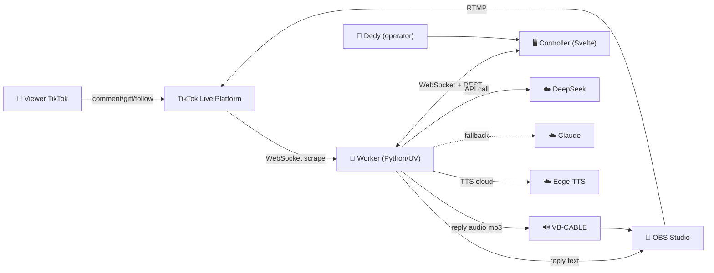
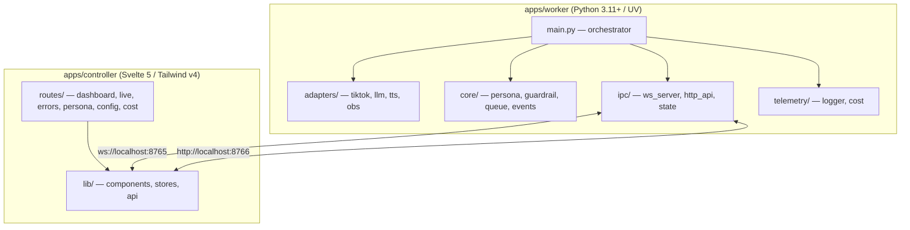
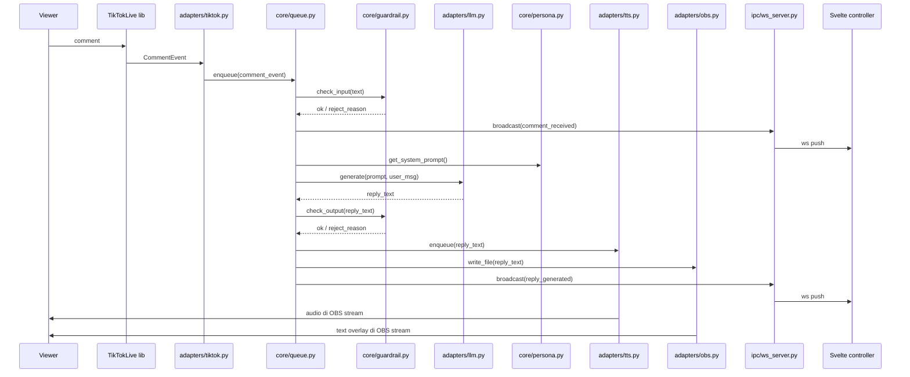

# 🏗️ 02 · Architecture — Sistem & Data Flow

> **Canonical**: arsitektur monorepo + data flow event. Mirror dari Notion.  
> Baca sebelum bikin modul baru.

---

## 1. Context Diagram (C4 Level 1)



---

## 2. Container Diagram (C4 Level 2) — Monorepo



---

## 3. Component — Worker Modules

| Module | Path | Responsibility | I/O |
|--------|------|----------------|-----|
| tiktok | adapters/tiktok.py | Wrap TikTokLiveClient, emit domain events | In: TikTok WS; Out: domain events |
| llm | adapters/llm.py | DeepSeek primary + Claude fallback | In: prompt+msg; Out: reply text + tokens |
| tts | adapters/tts.py | Edge-TTS synthesize + ffplay serial | In: text; Out: audio playback |
| obs | adapters/obs.py | Atomic write last_reply.txt | In: text; Out: file |
| persona | core/persona.py | Load + render system prompt | In: file path; Out: string |
| guardrail | core/guardrail.py | Regex blocklist check | In: text; Out: (ok, reason) |
| queue | core/queue.py | Rate-limit + dedup + priority | In: events; Out: throttled events |
| events | core/events.py | Domain event dataclasses | Pure types |
| ws_server | ipc/ws_server.py | WebSocket broadcast | In: events; Out: WS push |
| http_api | ipc/http_api.py | FastAPI REST endpoints | In: HTTP; Out: JSON |
| logger | telemetry/logger.py | Structured JSON logs | In: log calls; Out: JSONL files |
| cost | telemetry/cost.py | Token counter + Rp estimate | In: token counts; Out: cost data |

---

## 4. Data Flow — End-to-End Reply



---

## 5. IPC Protocol — Worker ↔ Controller

### 5a. WebSocket `ws://localhost:8765`

Server push-only (controller mendengar). Payload JSON Lines:

```json
{"type":"comment_received","ts":"2026-04-22T10:15:03+07:00","payload":{"user":"nickname","text":"bang lampunya berapa","id":"abc123"}}
{"type":"reply_generated","ts":"...","payload":{"comment_id":"abc123","reply":"...","latency_ms":3200,"tokens":{"in":180,"out":45}}}
{"type":"reply_rejected","ts":"...","payload":{"reason":"guardrail:url","original":"..."}}
{"type":"error","ts":"...","payload":{"module":"adapters/llm","code":"RATE_LIMIT","message":"..."}}
{"type":"heartbeat","ts":"...","payload":{"queue_size":3,"token_used":45210,"cost_rp":580}}
```

### 5b. REST `http://localhost:8766`

| Method | Path | Body | Response |
|--------|------|------|----------|
| GET | /api/status | — | {status, uptime, queue_size} |
| POST | /api/control/pause | — | {ok} |
| POST | /api/control/resume | — | {ok} |
| POST | /api/control/stop | — | {ok} |
| POST | /api/control/skip | {comment_id} | {ok} |
| GET | /api/persona | — | {content: string} |
| PUT | /api/persona | {content} | {ok} |
| POST | /api/persona/test | {comment} | {reply} |
| GET | /api/config | — | {settings} |
| POST | /api/config | {settings} | {ok} |
| GET | /api/config/schema | — | JSON Schema |
| GET | /api/cost | — | {today, week, month, sessions[]} |
| GET | /api/errors | — | {errors[]} |

---

## 6. Concurrency Model

- Main process = asyncio event loop
- 4 long-lived tasks via `asyncio.TaskGroup` (Python 3.11+):
  - `tiktok_listener` — TikTokLive WS
  - `reply_worker` — queue consumer → LLM → TTS → OBS
  - `ws_server` — WebSocket broadcast
  - `http_server` — FastAPI REST
- Queue serialization untuk TTS supaya audio tidak tumpang tindih
- LLM calls fire-and-forget (bounded semaphore N=3 concurrent)

---

## 7. Storage & Files

- `.env` — secrets (tidak di-commit)
- `config/persona.md` — system prompt (editable via UI)
- `obs/last_reply.txt` — text overlay bridge (ephemeral)
- `logs/banghack-YYYY-MM-DD.log` — JSONL logs
- `logs/session-<timestamp>.json` — full session export
- `_out.mp3` — TTS temp file (di-overwrite)

---

## 8. Error Taxonomy (summary, detail di Error Handling doc)

| Domain | Code prefix | Contoh |
|--------|-------------|--------|
| TikTok | TIKTOK_ | TIKTOK_DISCONNECT, TIKTOK_ROOM_NOT_LIVE |
| LLM | LLM_ | LLM_RATE_LIMIT, LLM_TIMEOUT, LLM_FALLBACK |
| TTS | TTS_ | TTS_NETWORK, TTS_FFPLAY_NOT_FOUND |
| Guardrail | GUARDRAIL_ | GUARDRAIL_INPUT_BLOCKED, GUARDRAIL_OUTPUT_BLOCKED |
| OBS | OBS_ | OBS_WRITE_FAIL |
| IPC | IPC_ | IPC_WS_DISCONNECT |

---

## 9. Security

- Secrets hanya di `.env` (di `.gitignore`)
- REST API bind ke `127.0.0.1` only (localhost)
- WebSocket tanpa auth OK karena loopback-only
- Log tidak menyimpan full API key (mask `sk-***`)
- Persona file di-sanitize sebelum dikirim ke LLM (no prompt injection via viewer comment — comment di-wrap di tag user)

---

## 10. Extensibility Points

- **New event type** → tambah di `core/events.py` + handler di `adapters/tiktok.py` + broadcast WS
- **New LLM provider** → tambah adapter di `adapters/llm.py` implementing `LLMProvider` protocol
- **New TTS voice** → edit `.env` `TTS_VOICE` — no code change
- **New UI page** → tambah route di `apps/controller/src/routes/newpage/+page.svelte`
