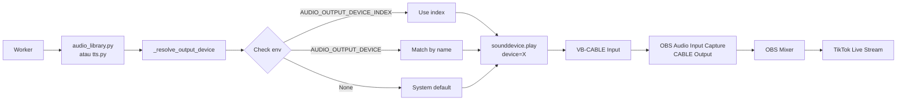

# Audio Routing Implementation — OBS Integration

**Status**: ✅ IMPLEMENTED (24 Apr 2026)  
**Version**: v0.4.6  
**Issue**: Audio routing ke OBS untuk live streaming

## 🎯 Problem Statement

Sebelum fix ini, audio dari worker (108 audio clips + TTS replies) keluar ke **laptop speaker**, BUKAN ke OBS. Ini karena:

1. `sounddevice.play()` di `audio_library.py` tidak specify device
2. `ffplay` di `tts.py` tidak specify `-audio_device`
3. Tidak ada env var untuk configure output device
4. Komentar di kode claim "→ VB-CABLE" tapi implementasi bohong

## ✅ Solution Implemented

### 1. Audio Library Adapter (`audio_library.py`)

**SUDAH ADA** (dari implementasi sebelumnya):
- Helper function `_resolve_output_device()` untuk resolve device dari env
- Method `_play_clip()` sudah menggunakan `device` parameter

```python
device = _resolve_output_device()
sd.play(data, samplerate, device=device)
```

### 2. TTS Adapter (`tts.py`)

**BARU DIIMPLEMENTASIKAN**:
- Ditambahkan helper function `_resolve_output_device()` (sama seperti audio_library)
- Method `_play_file()` diganti dari `ffplay` subprocess ke `sounddevice` playback
- Sekarang TTS replies juga route ke configured device

**Before**:
```python
async def _play_file(path: str) -> None:
    proc = await asyncio.create_subprocess_exec(
        "ffplay", "-nodisp", "-autoexit", "-loglevel", "quiet", path,
        ...
    )
    await proc.wait()
```

**After**:
```python
async def _play_file(path: str) -> None:
    import sounddevice as sd
    import soundfile as sf
    
    device = _resolve_output_device()
    data, samplerate = sf.read(path, dtype="float32")
    sd.play(data, samplerate, device=device)
    
    loop = asyncio.get_event_loop()
    await loop.run_in_executor(None, sd.wait)
```

### 3. Environment Configuration

**Ditambahkan ke `.env` dan `.env.example`**:

```bash
# ============================================================
# Audio Routing (untuk OBS via VB-CABLE)
# ============================================================
# Nama device output (substring match, case-insensitive)
AUDIO_OUTPUT_DEVICE=CABLE Input

# Atau gunakan index device langsung (prioritas lebih tinggi)
AUDIO_OUTPUT_DEVICE_INDEX=
```

**Priority logic**:
1. `AUDIO_OUTPUT_DEVICE_INDEX` (explicit index) — highest priority
2. `AUDIO_OUTPUT_DEVICE` (name substring match) — fallback
3. `None` (system default) — jika tidak ada config

### 4. Testing & Verification Tools

**Created 2 new scripts**:

#### `scripts/list_audio_devices.py`
- List semua audio output devices
- Tampilkan index dan nama device
- Highlight VB-CABLE devices
- Guidance untuk configure `.env`

#### `scripts/test_audio_routing.py`
- Verify VB-CABLE installation
- Verify `.env` configuration
- Play test tone (440 Hz, 2 seconds)
- Checklist untuk verify OBS integration

## 📋 Setup Instructions

### Quick Setup (10 menit)

1. **Install VB-CABLE**:
   ```bash
   # Download dari https://vb-audio.com/Cable/
   # Extract → jalankan VBCABLE_Setup_x64.exe as Admin
   # RESTART WINDOWS (wajib!)
   ```

2. **List audio devices**:
   ```bash
   cd livetik
   python scripts/list_audio_devices.py
   ```

3. **Configure `.env`**:
   ```bash
   # Tambahkan salah satu:
   AUDIO_OUTPUT_DEVICE=CABLE Input
   # atau
   AUDIO_OUTPUT_DEVICE_INDEX=5
   ```

4. **Test audio routing**:
   ```bash
   python scripts/test_audio_routing.py
   ```
   Cek apakah test tone keluar di OBS audio meter.

5. **Setup OBS**:
   - Add source: **Audio Input Capture**
   - Device: `CABLE Output (VB-Audio Virtual Cable)`
   - Advanced Audio Properties → Monitor: **Monitor and Output**

6. **Final test**:
   ```bash
   cd apps/worker
   uv run python -m banghack
   ```
   Buka http://localhost:5173/library → klik Play clip → verify OBS meter bergerak.

## 🔍 How It Works



## ✅ Verification Checklist

Sebelum go live, pastikan:

- [ ] VB-CABLE terinstall (cek di Windows Sound settings)
- [ ] `.env` configured: `AUDIO_OUTPUT_DEVICE=CABLE Input`
- [ ] `python scripts/test_audio_routing.py` → test tone keluar di OBS
- [ ] Worker log tampil: `audio_library: matched device X: CABLE Input`
- [ ] Worker log tampil: `tts: matched device X: CABLE Input`
- [ ] Dashboard `/library` → play clip → OBS meter bergerak
- [ ] Audio TIDAK keluar di laptop speaker
- [ ] Audio keluar di headphone (via OBS monitor)

## 🐛 Troubleshooting

### Audio masih keluar di laptop speaker

**Cause**: Device tidak ter-configure atau nama salah  
**Fix**:
```bash
python scripts/list_audio_devices.py
# Cari device "CABLE Input", catat indexnya
# Update .env dengan index yang benar
AUDIO_OUTPUT_DEVICE_INDEX=5
```

### OBS audio meter tidak bergerak

**Cause**: OBS source salah atau monitor off  
**Fix**:
- OBS source harus: **Audio Input Capture** → Device: `CABLE Output`
- Bukan "Desktop Audio" atau "Application Audio Capture"
- Advanced Audio Properties → Monitor: **Monitor and Output**

### Worker log: "device not found"

**Cause**: VB-CABLE belum terinstall atau Windows belum restart  
**Fix**:
- Install VB-CABLE dari https://vb-audio.com/Cable/
- **RESTART WINDOWS** (wajib!)
- Verify: Windows Sound settings → Output → harus ada "CABLE Input"

### Audio double (keluar di speaker DAN OBS)

**Cause**: Windows default device = CABLE Input  
**Fix**:
- Windows Sound settings → Output → set ke speaker laptop
- Biarkan `.env` yang handle routing ke CABLE
- Jangan set CABLE sebagai Windows default

## 📝 Technical Notes

### Why sounddevice instead of ffplay?

1. **Reliability**: `ffplay -audio_device` di Windows flaky dan tidak konsisten
2. **Consistency**: Kedua adapter (`audio_library.py` dan `tts.py`) sekarang pakai method yang sama
3. **Control**: Lebih mudah handle device selection dan error handling
4. **Dependencies**: `sounddevice` + `soundfile` sudah ada di requirements

### Device Resolution Logic

```python
def _resolve_output_device() -> int | None:
    # 1. Try explicit index (highest priority)
    if AUDIO_OUTPUT_DEVICE_INDEX is digit:
        return int(AUDIO_OUTPUT_DEVICE_INDEX)
    
    # 2. Try name match (case-insensitive substring)
    if AUDIO_OUTPUT_DEVICE:
        for i, device in enumerate(all_devices):
            if AUDIO_OUTPUT_DEVICE.lower() in device.name.lower():
                return i
    
    # 3. Fallback to system default
    return None
```

### Logging

Worker akan log device selection:
```
INFO audio_library: matched device 5: CABLE Input (VB-Audio Virtual Cable)
INFO tts: matched device 5: CABLE Input (VB-Audio Virtual Cable)
```

Kalau tidak ada config:
```
INFO audio_library: no AUDIO_OUTPUT_DEVICE set, using system default
INFO tts: no AUDIO_OUTPUT_DEVICE set, using system default
```

## 🔗 Related Files

- `apps/worker/src/banghack/adapters/audio_library.py` — Audio clip playback
- `apps/worker/src/banghack/adapters/tts.py` — TTS reply playback
- `.env` — Runtime configuration
- `.env.example` — Configuration template
- `scripts/list_audio_devices.py` — Device discovery tool
- `scripts/test_audio_routing.py` — Integration test
- `docs/instruksi/🎬 livetik — LIVE READY SOP` — Complete SOP

## 🎬 Ready for Live

Setelah semua checklist ✅, sistem READY FOR LIVE:
- Audio clips (108 files) → route ke OBS ✅
- TTS replies (Cartesia/Edge-TTS) → route ke OBS ✅
- Live Director auto-rotation → works ✅
- Comment classifier + suggester → works ✅
- Dashboard monitoring → works ✅

**GO LIVE!** 🚀
