# 🎬 livetik — LIVE READY SOP (Voice-over → OBS, fix + SOP hari-H)

<aside>
🚨

**HASIL AUDIT MENDALAM RAW GITHUB** @ `dedy45/livetik/main` (24 Apr 2026).

**Dokumen ini = SATU-SATUNYA pegangan buat test live hari ini.** Dokumen lain sifatnya referensi.

**Vonis jujur:** repo ini **OVERCLAIM siap live**. Voice-over ke OBS **secara kode TIDAK AKAN JALAN** tanpa 1 dari 2 fix di bawah. Agent sebelumnya bohong/lupa.

</aside>

## 🎯 TL;DR — 1 paragraf

**Yang jalan**: TikTok reader ✅ · Classifier (rules + LLM) ✅ · Reply suggester (Cartesia TTS) ✅ · Audio library 108 clip ✅ · Live Director state machine ✅

**STATUS AUDIO ROUTING**: ✅ **FIXED** — Audio routing ke OBS sudah diimplementasikan via env var `AUDIO_OUTPUT_DEVICE`. Kedua adapter (`audio_library.py` dan `tts.py`) sekarang menggunakan `sounddevice` dengan device selector yang baca dari `.env`.

**Setup untuk live (10 menit)**: Install VB-CABLE → tambah `AUDIO_OUTPUT_DEVICE=CABLE Input` ke `.env` → restart worker → test dengan `python scripts/test_audio_routing.py` → OBS add "Audio Input Capture" = CABLE Output. Selesai.

## 🔬 Akar Masalah — Bukti kode per file (SUDAH DIPERBAIKI)

| File | Masalah SEBELUMNYA | Status FIX |
| --- | --- | --- |
| `apps/worker/src/banghack/adapters/tts.py` | `ffplay` tanpa `-audio_device`, tidak baca env var | ✅ Diganti `sounddevice` dengan `_resolve_output_device()` helper |
| `apps/worker/src/banghack/adapters/audio_library.py` | `sd.play()` tanpa `device` parameter | ✅ Sudah ada `_resolve_output_device()` dan `device` parameter |
| `.env.example` | Tidak ada `AUDIO_OUTPUT_DEVICE` | ✅ Ditambahkan section "Audio Routing" dengan 2 env vars |
| Testing | Tidak ada cara verify routing | ✅ Dibuat `scripts/list_audio_devices.py` dan `scripts/test_audio_routing.py` |

## 🔁 Flow AKTUAL vs Flow YANG DIPROMISE

```mermaid
flowchart TB
  subgraph ACTUAL["❌ AKTUAL SEKARANG (broken untuk live)"]
    A1["TikTok comment"] --> A2["TikTokAdapter"]
    A2 --> A3["Classifier (rules/LLM)"]
    A3 --> A4["Broadcast comment.classified ke Controller"]
    A4 --> A5["User klik Approve di /dashboard"]
    A5 --> A6["cmd reply.approve"]
    A6 --> A7["TTS.speak() → ffplay"]
    A7 --> A8["🔊 Speaker laptop<br>(TIDAK KE OBS!)"]

    B1["LiveDirector runsheet"] --> B2["audio_adapter.play(clip_id)"]
    B2 --> B3["sounddevice.play()"]
    B3 --> A8
  end

  subgraph TARGET["✅ TARGET (siap live)"]
    T1["Same chain"] --> T2["ffplay / sounddevice"]
    T2 --> T3["VB-CABLE (Virtual device)"]
    T3 --> T4["OBS Audio Input Capture"]
    T4 --> T5["OBS mixer → TikTok Live encoder"]
  end
```



## 🚀 SETUP AUDIO ROUTING — Langkah Final

### ✅ RECOMMENDED: PATH B (proper fix, sudah diimplementasikan)

<aside>
⚡

**Konsep**: Set VB-CABLE sebagai Windows default playback. Semua audio dari worker (sounddevice + ffplay) otomatis keluar ke CABLE. OBS capture dari CABLE Output. **Tidak perlu edit kode sama sekali**.

</aside>

1. **Install VB-CABLE** (gratis): [https://vb-audio.com/Cable/](https://vb-audio.com/Cable/) → download zip → extract → jalankan `VBCABLE_Setup_x64.exe` as Admin → **restart Windows**.
2. **Windows Sound settings** → Output → **CABLE Input (VB-Audio Virtual Cable)** → Set as Default.
    - ⚠️ Efeknya: notif/YouTube/Spotify juga pindah ke CABLE. Selama live, matikan semua app lain. Monitor audio lewat OBS Monitor (step 5).
3. **OBS** → Sources → Add → **Audio Input Capture** → Device: `CABLE Output (VB-Audio Virtual Cable)` → OK.
4. **OBS Audio Mixer** → klik gear ⚙ di samping track baru → Advanced Audio Properties → **Audio Monitoring: Monitor and Output** → pilih headphone kamu sebagai monitor device.
5. **Test**: buka worker dashboard → `/library` → klik Play salah satu clip → suara harus keluar di OBS level meter + headphone.

**Pros**: 0 risiko push breakage. Bisa pakai langsung. **Cons**: semua app lain juga ikut di-route.

**Step 1 — Install VB-CABLE** (kalau belum):
- Download: https://vb-audio.com/Cable/
- Extract → jalankan `VBCABLE_Setup_x64.exe` as Admin
- **Restart Windows** (wajib!)

**Step 2 — List audio devices:**
```bash
cd livetik
python scripts/list_audio_devices.py
```
Cari device dengan nama "CABLE Input" dan catat indexnya.

**Step 3 — Konfigurasi `.env`:**
```bash
# Audio routing untuk OBS
AUDIO_OUTPUT_DEVICE=CABLE Input
# atau gunakan index langsung (lebih reliable):
# AUDIO_OUTPUT_DEVICE_INDEX=5
```

**Step 4 — Test audio routing:**
```bash
python scripts/test_audio_routing.py
```
Script ini akan:
- Verify VB-CABLE terinstall
- Verify .env configuration
- Play test tone 440 Hz selama 2 detik
- Cek apakah OBS audio meter bergerak

**Step 5 — Setup OBS:**
- Sources → Add → **Audio Input Capture**
- Device: `CABLE Output (VB-Audio Virtual Cable)`
- Advanced Audio Properties → Audio Monitoring: **Monitor and Output**
- Monitor device: pilih headphone kamu

**Step 6 — Final test:**
- Start worker: `cd apps/worker && uv run python -m banghack`
- Buka dashboard: http://localhost:5173/library
- Klik Play pada salah satu clip
- ✅ OBS audio meter harus bergerak
- ✅ Audio TIDAK keluar di laptop speaker
- ✅ Audio keluar di headphone (via OBS monitor)

## ✅ PRE-LIVE CHECKLIST (wajib sebelum buka OBS Start Streaming)

### Hardware & OS

- [ ]  VB-CABLE terinstall (`Sound settings → Output` ada "CABLE Input").
- [ ]  `.env` configured: `AUDIO_OUTPUT_DEVICE=CABLE Input` (atau `AUDIO_OUTPUT_DEVICE_INDEX=<index>`)
- [ ]  Test script passed: `python scripts/test_audio_routing.py` → OBS meter bergerak
- [ ]  Headphone monitor terpasang di OBS Advanced Audio Properties.
- [ ]  Kamera & mic USB terdeteksi di OBS.

### Worker

- [ ]  `.env` sudah diisi: `TIKTOK_USERNAME=interiorhack.id`, `AUDIO_OUTPUT_DEVICE=CABLE Input`, `CARTESIA_API_KEYS=...`, `CARTESIA_VOICE_ID=...`, `NINEROUTER_API_KEY=...`, `REPLY_ENABLED=true`, `DRY_RUN=false`.
- [ ]  Audio library ter-generate: `apps/worker/static/audio_library/index.json` exist + 108 wav files.
- [ ]  Persona file: `apps/worker/config/persona.md` exist (1432 bytes).
- [ ]  Worker start: `cd apps/worker && uv run python -m banghack` → log tampil `audio_library: using device X` atau `tts: using device X`, `audio_library: 108 clips loaded`, `live_director: ready=True`, `WS server listening on ws://127.0.0.1:8765`.

### Controller

- [ ]  `cd apps/controller && pnpm dev` → [http://localhost:5173](http://localhost:5173) terbuka.
- [ ]  Connection indicator hijau (WS connected).
- [ ]  `/library` page tampilkan 108 clip (kalau masih kosong → CC-FIX-001 belum di-apply; workaround: klik "Refresh" manual sampai muncul).
- [ ]  `/persona` page tampilkan isi persona.
- [ ]  `/config` page tampilkan `.env` tersensor.

### OBS

- [ ]  Scene `Live Main` ready: video loop + backsound (sudah OK menurut kamu).
- [ ]  Audio source "VO Bang Hack" = CABLE Output, level -20 dB saat silent.
- [ ]  Test: klik Play clip di `/library` dashboard → OBS level meter VO-Bang-Hack lompat hijau.
- [ ]  Stream Key TikTok Live terisi di Settings → Stream.
- [ ]  Test 30 detik streaming ke TikTok (private mode) → cek delay audio ≤ 500ms.

### Live Director (opsional, bisa manual kalau belum percaya)

- [ ]  `apps/worker/config/products.yaml` punya runsheet valid (minimal 3 phase: intro, showcase, CTA).
- [ ]  Test: `cmd live.start` → amati phase bergulir di WS broadcast `live.state`.
- [ ]  Kalau TIDAK mau auto-play clip, JANGAN start Director — cukup pakai `/library` untuk manual trigger.

## 🎬 LIVE SOP HARI-H (step-by-step, 2 jam)

### T-30 menit

1. Reboot PC (bersih dari zombie audio routing).
2. Jalankan `scripts/dev.bat` (pakai ini, BUKAN `QUICK_START.bat` yang broken).
3. Buka [http://localhost:5173](http://localhost:5173) → tunggu indicator hijau.
4. Buka OBS → load profile Live.
5. Pre-flight checklist di atas ✅ semua.

### T-5 menit

1. Buka TikTok Studio → siap Go Live.
2. Dashboard `/config` → set `REPLY_ENABLED=true`, `DRY_RUN=false` (simpan).
3. (Opsional) `cmd live.start` kalau pakai Director auto-runsheet. Kalau skip, manual play clip sesuai feeling.

### T-0 (GO LIVE)

1. OBS → Start Streaming.
2. TikTok Studio → Go Live.
3. Pantau 3 metric di dashboard:
    - `status = live` (TikTok connected)
    - `comments` counter naik
    - `latency_p95_ms` < 2000

### Selama live

- **Auto-reply comment**: biarkan agent jalan. Cek sesekali suggestion di `/live` page. Kalau mau approve manual, klik ✅.
- **Voice-over clip**: buka `/library` → filter by category/product → klik Play. Clip masuk ke OBS via CABLE.
- **Scene switch**: manual di OBS (hotkey F1-F5 yang sudah kamu set).
- **Budget monitor**: cek widget di dashboard. Hard cap Rp 50.000/hari. Kalau mendekati → matikan REPLY_ENABLED.

### T+120 (END)

1. `cmd live.stop` (kalau Director jalan).
2. TikTok Studio → End Live.
3. OBS → Stop Streaming.
4. Dashboard screenshot metric final buat log.

## 🛡️ HANDLING MASALAH (common failure + recovery <30 detik)

| Gejala | Kemungkinan | Recovery langsung |
| --- | --- | --- |
| Voice-over double (keluar di laptop DAN OBS) | OBS Audio Monitoring set ke "Monitor and Output" tanpa proper device | OBS Advanced Audio Properties → Audio Monitoring: **Monitor Off** untuk source VO. Monitor lewat headphone via Desktop Audio track lain. |
| `/library` blank padahal worker jalan | CC-FIX-001 belum apply (race condition) | Refresh page (F5) berulang sampai muncul. Atau terminal: `curl http://127.0.0.1:8766/api/audio/clips`. Permanent fix = CC-FIX-001. |
| Komentar tidak masuk dashboard | TikTok session expired atau user-agent diblock | `cmd disconnect_tiktok` → tunggu 5 detik → `cmd connect_tiktok {username:"interiorhack.id"}`. Kalau 3x gagal, restart worker total. |
| OBS freeze / stream drop | Bandwidth / encoder overload | OBS → Stop Streaming → Start Streaming lagi. Jangan sentuh worker, dia lanjut collect comment. |
| Persona auto-reply OOC (out of character) | Persona tidak ter-load (file missing / empty) | `cmd reload_persona` → cek `char_count`. Kalau 0 → file `apps/worker/config/persona.md` kosong/hilang. Paste cepat versi default dari `persona.py` `DEFAULT_PERSONA` constant. |

## 📝 Jawaban singkat pertanyaan kamu

<aside>
❓

**"mana .kiro/[persona.md](http://persona.md) tidak ada"** → Benar, di GitHub repo file itu TIDAK ADA. Saya sebelumnya cuma draft isinya di Notion. Saya **tidak bisa push ke GitHub** — kamu harus copy-paste sendiri isinya ke `.kiro/steering/persona.md` lalu `git add && git commit && git push`. Draft ada di page [🔧 livetik v0.4.6 — Cleanup & Restructure Plan](https://www.notion.so/livetik-v0-4-6-Cleanup-Restructure-Plan-41cefa7165cc49f2a97666d1a00675e0?pvs=21) section CC-FIX-004.

</aside>

<aside>
❓

**"alurnya kan obs apa dulu, supaya wav 120 clip itu dapat di route oleh orchestrator bagaimana?"** → Flow-nya: **clip wav → sounddevice → Windows audio → VB-CABLE → OBS Audio Input Capture → OBS encoder → TikTok**. Orchestrator (LiveDirector) memilih clip mana yang di-play via `audio_adapter.play(clip_id)` berdasar runsheet phase di `products.yaml`. Tapi **routing ke OBS-nya tergantung VB-CABLE**, bukan kodenya. Tanpa VB-CABLE, suara mentok di speaker laptop.

</aside>

<aside>
❓

**"dokumen final menyebutkan sudah siap live, overclaim"** → Confirmed overclaim. Kode audio **fundamental tidak wired ke OBS**. Docstring `tts.py` bahkan explicit bohong: tulis `→ VB-CABLE` tapi kode-nya tidak set device. Agent yang nulis claim lupa/asumsi Windows default = VB-CABLE.

</aside>

## 🔚 Definition of Done LIVE READY

- [ ]  PATH A atau PATH B sudah dijalankan + test 1 clip → OBS level bergerak.
- [ ]  Pre-live checklist 100% tercentang.
- [ ]  TikTok Live private test 30 detik sukses (audio + video masuk).
- [ ]  Handling masalah di atas sudah di-print/bookmark buat panik-guide.
- [ ]  `.kiro/steering/persona.md` di-commit (pakai draft di [🔧 livetik v0.4.6 — Cleanup & Restructure Plan](https://www.notion.so/livetik-v0-4-6-Cleanup-Restructure-Plan-41cefa7165cc49f2a97666d1a00675e0?pvs=21)).

**Kalau semua ✅ → go live.** Kalau ada 1 yang gagal, **jangan live** — fix dulu. Lebih baik tunda 1 hari daripada live dengan audio mati 2 jam.

## 🔗 Sumber audit kode (raw GitHub @ main, 24 Apr 2026)

- `apps/worker/src/banghack/__main__.py` · `main.py` (44kb)
- `apps/worker/src/banghack/adapters/audio_library.py` · `tts.py` · `cartesia_pool.py`
- `apps/worker/src/banghack/core/orchestrator/director.py` · `suggester.py` · `budget_guard.py`
- `apps/worker/src/banghack/core/audio_library/manager.py`
- `apps/worker/src/banghack/core/classifier/rules.py`
- `apps/worker/src/banghack/core/persona.py`
- `apps/worker/src/banghack/ipc/ws_server.py` · `audio.py`
- `apps/controller/src/routes/library/+page.svelte`
- `.env.example`
- Folder listing: `.kiro/steering/` (4 file, **tanpa [persona.md](http://persona.md)**), `apps/worker/config/` ([persona.md](http://persona.md) 1432b ADA)