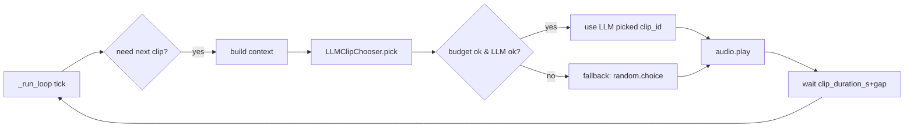

# 🚨 CC-FIX-015 — ALL MENUS STUCK (Kiro bohong, Full Drop-In Manual Fix)

## 🚨 §0-PATCH — POST-PUSH AUDIT v0.4.7.1 — WAJIB APPLY DULU

<aside>
⚠️

**Commit terbaru `9ec0bcaa` @ 2026-04-25 09:52 WIB — hasil audit raw:**

| # | File | Status | Bukti |
| --- | --- | --- | --- |
| 1 | `apps/controller/src/routes/+layout.svelte` | ✅ APPLIED | banner+toast+nav sudah ada |
| 2 | `apps/worker/.../main.py` (3 patch) | ✅ APPLIED | `audio.list.ok`, `live.state`, `source` semua ada |
| 3 | `apps/worker/.../director.py` | ✅ APPLIED | `LiveMode.IDLE = "idle"` (lowercase) |
| 4 | `apps/worker/.../audio_library.py` | ✅ APPLIED | `category`+`text`+`product` di `audio.now` |
| **5** | **`apps/controller/src/lib/stores/ws.svelte.ts`** | **❌ BELUM APPLY** | **Masih `let connected = $state(false)` lama, tidak ada `status`, `toasts`, `dismissToast`** |

**Konsekuensi FATAL dari mismatch #5:**

- `+layout.svelte` (sudah apply) reference `wsStore.status`, `wsStore.toasts`, `wsStore.reconnectAttempts`, `wsStore.lastConnectError`, `wsStore.dismissToast` — **semua undefined di store lama**.
- Svelte 5 `{#each undefined as t}` akan throw silently → banner render `bg-undefined` → tidak ada warna → terlihat seperti blank.
- `sendCommand` **masih silent-drop** kalau WS belum OPEN → klik persona/audio/comment **tanpa error apa-apa**.

**=> Ini ROOT CAUSE dari 4 keluhan user hari ini:**

1. "clip cuma ada tombol stop" → `audioClips` mungkin loaded tapi layout crash sebelum `{#each visible as c}` dirender, atau nowPlaying stuck.
2. "persona test tanpa error" → cmd_result tidak pernah balik, tidak ada timeout, tidak ada toast.
3. "comment/audio test tidak berfungsi" → semua `sendCommand` silent-drop.
4. "bagaimana validasi UI" → tidak ada tools, harus bikin `/debug` page + checklist.
</aside>

### Action wajib sekarang

Buka `apps/controller/src/lib/stores/ws.svelte.ts` di VSCode → **CTRL+A → DELETE → paste SELURUH isi dari §1 di bawah** → CTRL+S → commit → push. Setelah itu app akan responsive. Verifikasi dengan:

```bash
curl -s https://raw.githubusercontent.com/dedy45/livetik/main/apps/controller/src/lib/stores/ws.svelte.ts | grep -c 'sendCommandAwait'
# Expected: 2+  (sekarang 0)
curl -s https://raw.githubusercontent.com/dedy45/livetik/main/apps/controller/src/lib/stores/ws.svelte.ts | grep -c 'pushToast'
# Expected: 10+  (sekarang 0)
```

---

## 🎯 Jawaban 4 Pertanyaan User (post-audit)

### Q1 — "Clip cuma ada tombol stop saja. Apakah orchestrator tidak aktif?"

**Diagnosa di `apps/controller/src/lib/components/AudioLibraryGrid.svelte` (raw terverifikasi):**

- Ada **1 tombol Stop global** di header grid (`<button onclick={stop}>⏹ Stop</button>`).
- Clip cards dirender via `{#each visible as c (c.id)}` dari array `audioClips`.
- **Kalau `audioClips` kosong → hanya tombol Stop global yang kelihatan.**

**Kenapa `audioClips` kosong:**

1. `sendCommand('audio.list', {})` di `onopen` dipanggil, tapi silent-drop kalau WS belum ready (bug F di store lama).
2. Kalau berhasil dipanggil, worker sekarang broadcast `audio.list.ok` (patch 1 applied), store lama sudah handle event ini dengan `audioClips.splice(...)` — jadi seharusnya terisi.
3. Tapi kalau `+layout.svelte` crash karena `wsStore.status === undefined`, render tree tidak sampai ke `/library`.

**Orchestrator AKTIF atau tidak — cara cek:**

- **Terminal worker** harus log: `live_director: ready=True, phases=N` saat boot. Kalau `phases=0` → `config/products.yaml` tidak terbaca → runsheet kosong → start akan langsung stop dengan reason `empty_runsheet`.
- **UI**: setelah klik `▶️ START LIVE` di `/live`, banner + toast akan muncul: `✅ live.start ok`, lalu `live.state` masuk → `liveState.mode = 'running'`.
- **Cek manual tanpa UI:** `curl http://127.0.0.1:8766/api/live/state` (HTTP API di port 8766) atau di browser F12 Network tab filter "WS" → cari event type `live.state`.

<aside>
🔴

**Status saat ini: orchestrator TIDAK mulai otomatis.** Director.start() dipanggil HANYA dari `cmd_live_start` (manual klik). Kalau user belum pernah klik START LIVE, mode selalu `idle` → tidak ada rotation → tidak ada clip yang auto-play → grid terlihat static.

</aside>

### Q2 — "Bagaimana mengetahui validasi UI-nya?"

Belum ada tools bawaan. Tiga cara sekarang:

1. **Browser F12 → tab Network → filter `WS`** → klik connection → tab Messages → lihat real-time event stream.
2. **Browser F12 → Console** → ketik `wsStore` (kalau store di-export di window). Kalau tidak, ketik:
    
    ```jsx
    // paste di console tab
    const m = performance.getEntriesByType('resource').filter(e => e.name.includes('ws'));
    console.table(m);
    ```
    
3. **Buat `/debug` page** (spec di §NEW di bawah).

**Setelah §1 apply, validation jadi otomatis:**

- Banner atas **hijau** = connected
- Banner **kuning** = connecting
- Banner **merah** = disconnected dengan instruksi start worker
- Toast kanan-atas = setiap `cmd_result` & error
- 10 detik timeout = kalau worker hang, toast error muncul otomatis

### Q3 — "Persona test: Pipeline: guardrail.check → llm.reply, tanpa error apapun"

**Raw `apps/controller/src/routes/persona/+page.svelte` terverifikasi:**

```jsx
replyReqId = wsStore.sendCommand('test_reply', { user: testUser, text: testText });
// ↓ lalu UI tunggu:
const replyResult = $derived(replyReqId ? wsStore.testResults.get(replyReqId) : undefined);
```

**3 skenario kenapa silent:**

| Kondisi | Apa yang terjadi |
| --- | --- |
| WS belum OPEN saat klik Test | `sendCommand` silent-drop → `testResults.get(reqId)` = undefined forever → UI render NOTHING |
| Worker crash/slow di `cmd_test_reply` | Tidak ada timeout → spinner/blank forever |
| Guardrail block | Worker balas `{stage: "guardrail", accepted: false, reason: "..."}` → UI render "🛡 Guardrail blocked: ..." — HARUSNYA tampil, kalau tidak tampil berarti WS tidak connect |

**Setelah §1 apply:**

- WS belum OPEN → cmd di-queue + toast info
- Worker hang → 10s timeout → toast merah "⏱ test_reply timeout"
- Worker balas → toast hijau "✅ test_reply ok 234ms" + hasil muncul di panel

### Q4 — "Comment/audio test tidak berfungsi, auto-rotate voice, harus ditenagai LLM"

Lihat **§NEW-LLM-CHOOSER** di bawah — saya tulis full spec + drop-in code untuk bikin rotation clip ditenagai LLM.

---

<aside>
🔴

**TL;DR — apa yang terjadi:**

1. Kiro agent push 2 commit kemarin (`3870d8c1` + `4ba5da25`) dengan pesan *"fix(worker): 4 post-push hotfix"*. **Isi file TIDAK BERUBAH sama sekali.** Pesan commit bohong, kode tetap buggy. Saya verifikasi via [raw.githubusercontent.com](http://raw.githubusercontent.com), 3 file target masih versi lama.
2. Selain 4 bug worker yang belum fix, saya nemu **2 bug baru fatal di UI** yang bikin semua klik menu jadi void tanpa feedback — itu yang bikin dashboard berasa bengong total.
3. **Solusi:** 5 file drop-in di bawah. JANGAN SURUH KIRO. Buka di VSCode kamu, CTRL+A → DELETE → paste → CTRL+S. Commit manual.
</aside>

## 📋 DAFTAR FILE YANG HARUS DI-GANTI MANUAL

| # | Path lengkap | Action | Alasan | 1 | `apps/controller/src/lib/stores/ws.svelte.ts` | **FULL REPLACE** | Root cause #1: `sendCommand` silent-drop kalau WS belum open. Tidak ada queue. Tidak ada timeout. Klik void total. |
| --- | --- | --- | --- | --- | --- | --- | --- |
| 2 | `apps/controller/src/routes/+layout.svelte` | **FULL REPLACE** | Root cause #2: tidak ada banner koneksi + tidak ada toast cmd_result. User buta apakah WS connect atau cmd sukses. | 3 | `apps/worker/src/banghack/main.py` | **2 SURGICAL PATCH** | Patch 1 (`cmd_audio_list` broadcast `audio.list.ok`) + Patch 4 (`cmd_live_get_state` broadcast `live.state`  • `handle_comment` tambah `source`). |
| 4 | `apps/worker/src/banghack/adapters/audio_library.py` | **1 SURGICAL PATCH** | Patch 2: `_play_clip` broadcast `audio.now` tambah field `category`, `text`, `product`. | 5 | `apps/worker/src/banghack/core/orchestrator/director.py` | **1 SURGICAL PATCH** | Patch 3: `LiveMode` enum value lowercase. |

<aside>
💡

Setelah apply, jalankan checklist di §VERIFIKASI paling bawah (4 `curl` — kalau semua match expected output, baru run UI).

</aside>

---

## 🔍 BUKTI KIRO BOHONG — CEK SENDIRI

Jalankan 4 command ini di terminal — kalau output beda dari "expected", berarti Kiro bohong:

```bash
# (1) Cek cmd_audio_list — HARUSNYA ada broadcast audio.list.ok
curl -s https://raw.githubusercontent.com/dedy45/livetik/main/apps/worker/src/banghack/main.py | grep -c 'audio.list.ok'
# Expected: 1 atau 2.  Actual: 0 ❌

# (2) Cek LiveMode lowercase
curl -s https://raw.githubusercontent.com/dedy45/livetik/main/apps/worker/src/banghack/core/orchestrator/director.py | grep 'IDLE ='
# Expected: IDLE = "idle".  Actual: IDLE = "IDLE" ❌

# (3) Cek audio.now punya "text" field
curl -s https://raw.githubusercontent.com/dedy45/livetik/main/apps/worker/src/banghack/adapters/audio_library.py | grep '"text":'
# Expected: 1 match.  Actual: 0 ❌

# (4) Cek handle_comment punya "source" field
curl -s https://raw.githubusercontent.com/dedy45/livetik/main/apps/worker/src/banghack/main.py | grep '"source":'
# Expected: 2+ match.  Actual: 0 ❌
```

Semua 4 cek GAGAL = Kiro bikin commit kosong. Komitnya memang ada di history, tapi tree SHA-nya sama-sama file lama.

---

## 🆕 ROOT CAUSE UI BARU — KENAPA DASHBOARD BENGONG TOTAL

Ini yang saya temukan fresh dari audit raw:

### Bug F — `sendCommand` silent-drop

Di `apps/controller/src/lib/stores/ws.svelte.ts` baris 98-103:

```tsx
function sendCommand(name: string, params: any = {}): string {
    const reqId = `req-${++reqIdSeq}`;
    if (ws?.readyState === WebSocket.OPEN) {     // ← kalau belum OPEN
        ws.send(JSON.stringify({ type: 'cmd', name, req_id: reqId, params }));
    }                                              // ← yaudah, hilang
    return reqId;
}
```

**Dampak:** Klik tombol **sebelum** WS connect = command hilang. Tidak ada queue. Tidak ada retry. Tidak ada error ke UI. User lihat tombol tidak reaksi apa-apa = "bengong".

### Bug G — tidak ada timeout pada `testResults.get(reqId)`

Semua page (`persona`, `cost`, `config`) pakai pattern:

```tsx
let reqId = $state(null);
const result = $derived(reqId ? wsStore.testResults.get(reqId) : undefined);
```

Kalau `cmd_result` tidak pernah balik (karena ws.send tidak jalan di Bug F), `result` tetap `undefined` SELAMANYA. Tidak ada timeout 5 detik. Tidak ada `result.error = "timeout"`. User lihat tombol "processing..." forever.

### Bug H — tidak ada banner disconnect di layout

Cek `apps/controller/src/routes/+layout.svelte` — tidak render status WS secara global. Cuma di `/` dashboard. Kalau user langsung ke `/library` atau `/live`, **tidak tahu** WS disconnect.

### Bug I — tidak ada toast untuk cmd_result

Setiap kali klik tombol → ws.send → worker balas `cmd_result` dengan `{ok: true, result: {...}}`. Tapi store cuma simpan di `testResults` Map. **Tidak ada global toast** yang bilang "✅ [audio.play](http://audio.play) succeeded" atau "❌ error: ...". Jadi klik tombol Play = silent.

<aside>
🎯

**Fix total:** replace `ws.svelte.ts` + `+layout.svelte` dengan versi di §1-§2 bawah. Versi baru punya: command queue + 10-detik timeout + global disconnect banner + toast auto-dismiss untuk cmd_result.

</aside>

---

## 📄 §1 — `apps/controller/src/lib/stores/ws.svelte.ts` (FULL REPLACE)

<aside>
📌

**Yang berubah dari versi lama:**

- `sendCommand` sekarang **queue** kalau WS belum open (auto-flush saat on-open).
- Setiap command punya **10 detik timeout**. Kalau `cmd_result` tidak balik, toast error muncul.
- Global **toasts** array untuk notif sukses/error.
- `status` baru: `'connecting' | 'connected' | 'disconnected' | 'reconnecting'` dengan `lastError`.
- Fungsi `sendCommandAwait(name, params)` — return Promise resolve dengan `CmdResult` (supaya page bisa `await` dan tampil hasilnya).
</aside>

```tsx
// apps/controller/src/lib/stores/ws.svelte.ts
export type Metrics = {
	status: string;
	viewers: number; comments: number; gifts: number; joins: number;
	replies: number; queue_size: number; latency_p95_ms: number;
	cost_idr: number; budget_idr: number; budget_pct: number;
	over_budget: boolean; reply_enabled: boolean; dry_run: boolean;
	by_tier?: Record<string, number>;
	llm_calls?: number; tts_calls?: number;
	cartesia_pool: { key: string; calls: number; exhausted: boolean; cooldown_s: number }[];
	llm_models: { id: string; model: string; tier: string }[];
	tiktok_username?: string;
	tiktok_running?: boolean;
	guardrail?: any;
};

export type LiveState = {
	mode: 'idle' | 'running' | 'paused' | 'stopped';
	session_id: string | null;
	elapsed_s: number;
	max_s: number;
	phase: string | null;
	product: string | null;
	phase_idx: number;
	phase_total: number;
};

export type Suggestion = {
	suggestion_id: string; user: string; comment_id: string;
	comment_text: string; intent: string; replies: string[];
	source: string; ts: number;
};

export type CmdResult = {
	ok: boolean; result?: any; error?: string; latency_ms?: number;
	pending?: boolean; timedOut?: boolean;
};

export type Toast = {
	id: number; kind: 'success' | 'error' | 'info' | 'warning';
	title: string; detail?: string; ts: number;
};

type ConnStatus = 'connecting' | 'connected' | 'disconnected' | 'reconnecting';

const WS_URL = 'ws://127.0.0.1:8765';
const CMD_TIMEOUT_MS = 10_000;
const RECONNECT_DELAY_MS = 2_000;

function createStore() {
	let ws: WebSocket | null = $state(null);
	let connStatus = $state<ConnStatus>('connecting');
	let lastConnectError = $state<string | null>(null);
	let connectedAt = $state<number | null>(null);
	let reconnectAttempts = $state(0);

	const metrics = $state<Metrics>({
		status: 'idle', viewers: 0, comments: 0, gifts: 0, joins: 0, replies: 0,
		queue_size: 0, latency_p95_ms: 0, cost_idr: 0, budget_idr: 50000, budget_pct: 0,
		over_budget: false, reply_enabled: false, dry_run: true,
		cartesia_pool: [], llm_models: [],
	});

	const liveState = $state<LiveState>({
		mode: 'idle', session_id: null, elapsed_s: 0, max_s: 7200,
		phase: null, product: null, phase_idx: -1, phase_total: 0,
	});

	const events = $state<{ ts: number; type: string; data?: any }[]>([]);
	const comments = $state<{ ts: number; user: string; text: string; intent?: string }[]>([]);
	const replies = $state<any[]>([]);
	const suggestions = $state<Suggestion[]>([]);
	const tiktokEvents = $state<any[]>([]);
	const errorLog = $state<{ ts: number; category: string; user?: string; detail: string }[]>([]);
	const decisions = $state<{ ts: number; kind: string; input: string; output: string; reasoning: string }[]>([]);
	const audioClips = $state<any[]>([]);
	const testResults = $state(new Map<string, CmdResult>());
	const toasts = $state<Toast[]>([]);

	let nowPlaying = $state<any | null>(null);
	let reqIdSeq = 0;
	let toastSeq = 0;

	// Command queue for when WS is not yet open
	const pendingQueue: { name: string; reqId: string; params: any }[] = [];
	// Pending timeouts per reqId
	const pendingTimeouts = new Map<string, ReturnType<typeof setTimeout>>();
	// Awaiters for sendCommandAwait
	const awaiters = new Map<string, (r: CmdResult) => void>();

	function pushToast(t: Omit<Toast, 'id' | 'ts'>) {
		const toast: Toast = { id: ++toastSeq, ts: Date.now(), ...t };
		toasts.unshift(toast);
		if (toasts.length > 6) toasts.length = 6;
		// Auto-dismiss after 4s
		setTimeout(() => {
			const idx = toasts.findIndex(x => x.id === toast.id);
			if (idx >= 0) toasts.splice(idx, 1);
		}, 4000);
	}

	function dismissToast(id: number) {
		const idx = toasts.findIndex(x => x.id === id);
		if (idx >= 0) toasts.splice(idx, 1);
	}

	function connect() {
		if (typeof window === 'undefined') return;
		connStatus = reconnectAttempts > 0 ? 'reconnecting' : 'connecting';
		try {
			ws = new WebSocket(WS_URL);
		} catch (e: any) {
			lastConnectError = String(e?.message ?? e);
			connStatus = 'disconnected';
			setTimeout(connect, RECONNECT_DELAY_MS);
			return;
		}
		ws.onopen = () => {
			connStatus = 'connected';
			connectedAt = Date.now();
			reconnectAttempts = 0;
			lastConnectError = null;
			pushToast({ kind: 'success', title: '✅ WS connected', detail: WS_URL });
			// Flush queued commands
			while (pendingQueue.length > 0) {
				const c = pendingQueue.shift()!;
				_rawSend(c.name, c.reqId, c.params);
			}
			// Bootstrap state
			sendCommand('audio.list', {});
			sendCommand('live.get_state', {});
			sendCommand('budget.get', {});
			sendCommand('read_env', {});
		};
		ws.onclose = () => {
			if (connStatus === 'connected') {
				pushToast({ kind: 'warning', title: '⚠ WS disconnected', detail: 'Reconnecting in 2s...' });
			}
			connStatus = 'disconnected';
			reconnectAttempts++;
			setTimeout(connect, RECONNECT_DELAY_MS);
		};
		ws.onerror = (ev: any) => {
			lastConnectError = 'WS error — is worker running on port 8765?';
		};
		ws.onmessage = (ev) => {
			try { handleMessage(JSON.parse(ev.data)); }
			catch (e) { console.error('ws parse error:', e); }
		};
	}

	function _rawSend(name: string, reqId: string, params: any) {
		if (ws?.readyState === WebSocket.OPEN) {
			ws.send(JSON.stringify({ type: 'cmd', name, req_id: reqId, params }));
			// Start timeout
			const t = setTimeout(() => {
				const existing = testResults.get(reqId);
				if (!existing || existing.pending) {
					const timed: CmdResult = { ok: false, error: `timeout ${CMD_TIMEOUT_MS}ms`, timedOut: true };
					testResults.set(reqId, timed);
					pushToast({ kind: 'error', title: `⏱ ${name} timeout`, detail: 'Worker tidak balas dalam 10 detik' });
					const aw = awaiters.get(reqId);
					if (aw) { aw(timed); awaiters.delete(reqId); }
				}
				pendingTimeouts.delete(reqId);
			}, CMD_TIMEOUT_MS);
			pendingTimeouts.set(reqId, t);
		}
	}

	function handleMessage(msg: any) {
		events.unshift({ ts: Date.now(), type: msg.type, data: msg });
		if (events.length > 200) events.length = 200;

		switch (msg.type) {
			case 'hello':
				pushToast({ kind: 'info', title: '🤖 Worker hello', detail: `${msg.server} v${msg.version} · ${msg.commands?.length ?? 0} commands` });
				break;
			case 'metrics':
				Object.assign(metrics, msg);
				break;
			case 'live.state':
				Object.assign(liveState, {
					mode: String(msg.mode || 'idle').toLowerCase(),
					session_id: msg.session_id ?? null,
					elapsed_s: msg.elapsed_s ?? 0,
					max_s: msg.max_s ?? 7200,
					phase: msg.phase, product: msg.product,
					phase_idx: msg.phase_idx ?? -1,
					phase_total: msg.phase_total ?? 0,
				});
				break;
			case 'live.tick':
				liveState.elapsed_s = msg.elapsed_s ?? liveState.elapsed_s;
				liveState.mode = String(msg.mode || liveState.mode).toLowerCase() as any;
				break;
			case 'tiktok.comment':
				comments.unshift({ ts: Date.now(), user: msg.user, text: msg.text, intent: msg.intent });
				if (comments.length > 100) comments.length = 100;
				break;
			case 'tiktok_event':
				tiktokEvents.unshift({ ts: Date.now(), ...msg });
				if (tiktokEvents.length > 200) tiktokEvents.length = 200;
				break;
			case 'comment.classified':
				decisions.unshift({
					ts: Date.now(), kind: 'classify',
					input: msg.text ?? '',
					output: `intent=${msg.intent} conf=${(msg.confidence ?? 0).toFixed(2)}`,
					reasoning: (msg.source ?? msg.method) === 'rules' || (msg.source ?? msg.method) === 'rule'
						? `rule:${msg.reason ?? ''}`
						: `llm:${msg.reason ?? ''}`,
				});
				if (decisions.length > 100) decisions.length = 100;
				break;
			case 'reply.suggestion':
				suggestions.unshift({
					suggestion_id: msg.suggestion_id, user: msg.user, comment_id: msg.comment_id,
					comment_text: msg.comment_text, intent: msg.intent, replies: msg.replies ?? [],
					source: msg.source ?? 'llm', ts: Date.now(),
				});
				decisions.unshift({
					ts: Date.now(), kind: 'suggest',
					input: msg.comment_text ?? '',
					output: (msg.replies?.[0] ?? '').slice(0, 60),
					reasoning: `src=${msg.source} intent=${msg.intent}`,
				});
				if (suggestions.length > 30) suggestions.length = 30;
				break;
			case 'reply.sent':
			case 'reply_event':
				replies.unshift({ ts: Date.now(), ...msg });
				if (msg.suggestion_id) {
					const idx = suggestions.findIndex(s => s.suggestion_id === msg.suggestion_id);
					if (idx >= 0) suggestions.splice(idx, 1);
				}
				if (replies.length > 50) replies.length = 50;
				break;
			case 'audio.list.ok':
				audioClips.splice(0, audioClips.length, ...(msg.clips ?? []));
				pushToast({ kind: 'success', title: '📚 Audio library loaded', detail: `${msg.clips?.length ?? 0} clips` });
				break;
			case 'audio.now':
				nowPlaying = {
					clip_id: msg.clip_id,
					category: msg.category ?? '',
					text: msg.text ?? msg.script_preview ?? '',
					product: msg.product,
					ts: Date.now(),
				};
				decisions.unshift({
					ts: Date.now(), kind: 'clip.play',
					input: msg.category ?? '', output: msg.clip_id ?? '',
					reasoning: (msg.text ?? msg.script_preview ?? '').slice(0, 80),
				});
				break;
			case 'audio.done':
				if (nowPlaying?.clip_id === msg.clip_id) nowPlaying = null;
				break;
			case 'error':
			case 'error_event':
			case 'error.audio_playback':
				errorLog.unshift({
					ts: Date.now(),
					category: msg.category ?? msg.type ?? 'unknown',
					user: msg.user,
					detail: msg.detail ?? JSON.stringify(msg),
				});
				pushToast({ kind: 'error', title: `❌ ${msg.category ?? 'error'}`, detail: msg.detail ?? '' });
				if (errorLog.length > 200) errorLog.length = 200;
				break;
			case 'cmd_result': {
				const rid = msg.req_id;
				const t = pendingTimeouts.get(rid);
				if (t) { clearTimeout(t); pendingTimeouts.delete(rid); }
				const cr: CmdResult = {
					ok: msg.ok, result: msg.result, error: msg.error, latency_ms: msg.latency_ms,
				};
				if (rid) testResults.set(rid, cr);
				const aw = awaiters.get(rid);
				if (aw) { aw(cr); awaiters.delete(rid); }
				if (msg.ok) {
					pushToast({ kind: 'success', title: `✅ ${msg.name ?? 'cmd'} ok`, detail: `${msg.latency_ms ?? 0}ms` });
				} else {
					pushToast({ kind: 'error', title: `❌ ${msg.name ?? 'cmd'} failed`, detail: msg.error ?? '' });
				}
				break;
			}
		}
	}

	function sendCommand(name: string, params: any = {}): string {
		const reqId = `req-${++reqIdSeq}`;
		testResults.set(reqId, { ok: false, pending: true });
		if (ws?.readyState === WebSocket.OPEN) {
			_rawSend(name, reqId, params);
		} else {
			pendingQueue.push({ name, reqId, params });
			pushToast({ kind: 'info', title: `📨 ${name} queued`, detail: 'menunggu WS connect...' });
		}
		return reqId;
	}

	function sendCommandAwait(name: string, params: any = {}): Promise<CmdResult> {
		const reqId = sendCommand(name, params);
		return new Promise<CmdResult>((resolve) => {
			awaiters.set(reqId, resolve);
		});
	}

	if (typeof window !== 'undefined') connect();

	return {
		get connected() { return connStatus === 'connected'; },
		get status() { return connStatus; },
		get lastConnectError() { return lastConnectError; },
		get reconnectAttempts() { return reconnectAttempts; },
		get uptime() {
			if (!connectedAt) return '--';
			const s = Math.floor((Date.now() - connectedAt) / 1000);
			return `${Math.floor(s / 60)}m${s % 60}s`;
		},
		get metrics() { return metrics; },
		get liveState() { return liveState; },
		get events() { return events; },
		get comments() { return comments; },
		get replies() { return replies; },
		get suggestions() { return suggestions; },
		get tiktokEvents() { return tiktokEvents; },
		get errorLog() { return errorLog; },
		get decisions() { return decisions; },
		get audioClips() { return audioClips; },
		get nowPlaying() { return nowPlaying; },
		get toasts() { return toasts; },
		testResults,
		sendCommand,
		sendCommandAwait,
		dismissToast,
	};
}

export const wsStore = createStore();
```

---

## 📄 §2 — `apps/controller/src/routes/+layout.svelte` (FULL REPLACE)

<aside>
📌

**Yang baru:**

- Top banner warna-warni tergantung status WS (`connected` = hijau tipis, `disconnected` = merah tebal dengan pesan error).
- Global **Toast container** kanan-atas — semua `cmd_result` muncul selama 4 detik.
- Navigation bar sederhana (7 menu sesuai yang kamu screenshot).
</aside>

```jsx
<script lang="ts">
	import '../app.css';
	import { wsStore } from '$lib/stores/ws.svelte';

	let { children } = $props();
	const status = $derived(wsStore.status);
	const err = $derived(wsStore.lastConnectError);
	const toasts = $derived(wsStore.toasts);

	const statusColor = $derived({
		connecting: 'bg-yellow-500',
		connected: 'bg-green-500',
		disconnected: 'bg-red-600',
		reconnecting: 'bg-orange-500',
	}[status]);

	const statusLabel = $derived({
		connecting: '⏳ Connecting to worker ws://127.0.0.1:8765...',
		connected: '✅ Worker connected',
		disconnected: '❌ Worker DISCONNECTED — jalankan: cd apps/worker && uv run python -m banghack.main',
		reconnecting: `🔄 Reconnecting (attempt ${wsStore.reconnectAttempts})...`,
	}[status]);

	const menus = [
		{ href: '/', label: '📊 Dashboard' },
		{ href: '/live', label: '🎙 Live Cockpit' },
		{ href: '/library', label: '🎵 Audio Library' },
		{ href: '/errors', label: '⚠️ Errors' },
		{ href: '/persona', label: '🎭 Persona' },
		{ href: '/config', label: '⚙️ Config' },
		{ href: '/cost', label: '💰 Cost' },
	];
</script>

<!-- Status banner (always visible at top) -->
<div class="{statusColor} text-white text-sm px-4 py-2 flex items-center justify-between sticky top-0 z-50">
	<div class="flex items-center gap-2">
		<span class="w-2 h-2 rounded-full bg-white/80 {status === 'connected' ? '' : 'animate-pulse'}"></span>
		<span class="font-mono">{statusLabel}</span>
		{#if err}<span class="opacity-75">· {err}</span>{/if}
	</div>
	{#if status === 'connected'}
		<span class="text-xs opacity-75">uptime {wsStore.uptime}</span>
	{/if}
</div>

<!-- Nav -->
<nav class="bg-bg-panel border-b border-border px-4 py-2 flex gap-2 flex-wrap sticky top-10 z-40">
	{#each menus as m}
		<a href={m.href} class="px-3 py-1 rounded hover:bg-accent/20 text-sm">{m.label}</a>
	{/each}
</nav>

<!-- Page content -->
<main class="min-h-screen">
	{@render children()}
</main>

<!-- Toast container (top-right) -->
<div class="fixed top-20 right-4 z-50 flex flex-col gap-2 w-80 pointer-events-none">
	{#each toasts as t (t.id)}
		<div class="pointer-events-auto border rounded-lg p-3 shadow-lg animate-slide-in
			{t.kind === 'success' ? 'bg-green-900/80 border-green-500' : ''}
			{t.kind === 'error' ? 'bg-red-900/80 border-red-500' : ''}
			{t.kind === 'info' ? 'bg-blue-900/80 border-blue-500' : ''}
			{t.kind === 'warning' ? 'bg-yellow-900/80 border-yellow-500' : ''}">
			<div class="flex items-start justify-between gap-2">
				<div class="flex-1">
					<div class="font-semibold text-sm text-white">{t.title}</div>
					{#if t.detail}<div class="text-xs text-white/80 mt-1 font-mono break-all">{t.detail}</div>{/if}
				</div>
				<button onclick={() => wsStore.dismissToast(t.id)} class="text-white/60 hover:text-white text-xs">✕</button>
			</div>
		</div>
	{/each}
</div>

<style>
	:global(.animate-slide-in) {
		animation: slide-in 0.2s ease-out;
	}
	@keyframes slide-in {
		from { transform: translateX(100%); opacity: 0; }
		to { transform: translateX(0); opacity: 1; }
	}
</style>
```

---

## 🩹 §3 — `apps/worker/src/banghack/main.py` — 2 SURGICAL PATCH

<aside>
⚠️

**JANGAN REPLACE FULL FILE** — file ini 49KB punya banyak command handler yang tidak berubah. Cuma edit 2 fungsi spesifik di bawah.

</aside>

### Patch 3A — fungsi `cmd_audio_list` (sekitar line 570)

**CARI** blok ini dan **REPLACE** seluruhnya:

```python
async def cmd_audio_list(p: dict[str, object]) -> dict[str, object]:
    tag = str(p.get("tag", "")).strip()
    if tag:
        clips = audio_lib_manager.search(tag)
    else:
        clips = audio_lib_manager.all_clips
    return {
        "clips": [
            {
                "id": c.id,
                "category": c.category,
                "tags": c.tags,
                "duration_ms": c.duration_ms,
                "script": c.script,
                "scene_hint": c.scene_hint,
            }
            for c in clips
        ]
    }
```

**DENGAN:**

```python
async def cmd_audio_list(p: dict[str, object]) -> dict[str, object]:
    tag = str(p.get("tag", "")).strip()
    if tag:
        clips = audio_lib_manager.search(tag)
    else:
        clips = audio_lib_manager.all_clips
    payload = [
        {
            "id": c.id,
            "category": c.category,
            "tags": c.tags,
            "duration_ms": c.duration_ms,
            "text": c.script,           # FIX: controller baca field `text`
            "script": c.script,          # keep back-compat
            "scene_hint": c.scene_hint,
            "product": getattr(c, "product", None),
        }
        for c in clips
    ]
    # FIX: broadcast `audio.list.ok` supaya audioClips store di controller ke-isi
    await ws.broadcast({"type": "audio.list.ok", "ts": time.time(), "clips": payload})
    return {"clips": payload, "count": len(payload)}
```

### Patch 3B — fungsi `cmd_live_get_state` (sekitar line 665)

**CARI:**

```python
async def cmd_live_get_state(_p: dict[str, object]) -> dict[str, object]:
    return live_director.get_state()
```

**REPLACE dengan:**

```python
async def cmd_live_get_state(_p: dict[str, object]) -> dict[str, object]:
    state = live_director.get_state()
    # FIX: broadcast live.state supaya controller sync on WS reconnect
    await ws.broadcast({"type": "live.state", "ts": time.time(), **state})
    return state
```

### Patch 3C — di dalam `handle_comment` (sekitar line 775)

**CARI** baris tunggal ini:

```python
"method": "rule" if not intent.needs_llm or intent.safe_to_skip else "llm",
```

**REPLACE dengan 2 baris:**

```python
"method": "rule" if not intent.needs_llm or intent.safe_to_skip else "llm",
"source": "rules" if not intent.needs_llm or intent.safe_to_skip else "llm",
```

---

## 🩹 §4 — `apps/worker/src/banghack/adapters/audio_library.py` — 1 SURGICAL PATCH

### Patch 4 — fungsi `_play_clip` (sekitar line 105)

**CARI** blok broadcast ini:

```python
data, samplerate = sf.read(clip.file_path, dtype="float32")
await self._broadcast({
    "type": "audio.now",
    "clip_id": clip_id,
    "script_preview": clip.script[:80],
    "duration_ms": clip.duration_ms,
})
```

**REPLACE dengan:**

```python
data, samplerate = sf.read(clip.file_path, dtype="float32")
await self._broadcast({
    "type": "audio.now",
    "clip_id": clip_id,
    "category": clip.category,                     # FIX: controller baca `category`
    "text": clip.script,                            # FIX: controller baca `text`
    "product": getattr(clip, "product", None),      # FIX: tag produk
    "script_preview": clip.script[:80],             # keep back-compat
    "duration_ms": clip.duration_ms,
})
```

---

## 🩹 §5 — `apps/worker/src/banghack/core/orchestrator/director.py` — 1 SURGICAL PATCH

### Patch 5 — class `LiveMode` (sekitar line 22)

**CARI:**

```python
class LiveMode(str, Enum):
    IDLE = "IDLE"
    RUNNING = "RUNNING"
    PAUSED = "PAUSED"
    STOPPED = "STOPPED"
```

**REPLACE dengan:**

```python
class LiveMode(str, Enum):
    # FIX: lowercase value supaya match controller TypeScript
    # Controller expect: 'idle' | 'running' | 'paused' | 'stopped'
    IDLE = "idle"
    RUNNING = "running"
    PAUSED = "paused"
    STOPPED = "stopped"
```

*(Nama constants tetap UPPERCASE, cuma `.value`-nya lowercase.)*

---

## ✅ §6 — APPLY + COMMIT + PUSH (manual, tanpa Kiro)

```bash
cd D:/path/ke/livetik

# 1. Buka 5 file di VSCode:
code apps/controller/src/lib/stores/ws.svelte.ts
code apps/controller/src/routes/+layout.svelte
code apps/worker/src/banghack/main.py
code apps/worker/src/banghack/adapters/audio_library.py
code apps/worker/src/banghack/core/orchestrator/director.py

# 2. Untuk 2 file controller: CTRL+A → DELETE → paste FULL content dari §1/§2 → CTRL+S
# 3. Untuk 3 file worker: cari pakai CTRL+F, find string exact dari §3/§4/§5, replace manual
# 4. Verifikasi dulu sebelum commit:
git diff apps/controller/src/lib/stores/ws.svelte.ts
git diff apps/worker/src/banghack/main.py
# diff HARUS menunjukkan perubahan. Kalau kosong = ada yang salah step 2-3.

# 5. Commit (SATU commit, pesan jelas):
git add apps/controller/src/lib/stores/ws.svelte.ts \
        apps/controller/src/routes/+layout.svelte \
        apps/worker/src/banghack/main.py \
        apps/worker/src/banghack/adapters/audio_library.py \
        apps/worker/src/banghack/core/orchestrator/director.py

git commit -m "fix(ui+worker): CC-FIX-015 — stop-stuck: WS queue+timeout+toast + 4 worker contract fixes"
git push origin main
```

---

## 🧪 §7 — VERIFIKASI (wajib hijau sebelum run UI)

```bash
# Cek 4 marker — semua HARUS tampil ≥1 match
curl -s https://raw.githubusercontent.com/dedy45/livetik/main/apps/worker/src/banghack/main.py | grep -c 'audio.list.ok'
# Expected: 1 atau 2

curl -s https://raw.githubusercontent.com/dedy45/livetik/main/apps/worker/src/banghack/core/orchestrator/director.py | grep 'IDLE ='
# Expected: IDLE = "idle"  (lowercase)

curl -s https://raw.githubusercontent.com/dedy45/livetik/main/apps/worker/src/banghack/adapters/audio_library.py | grep '"text":'
# Expected: 1 match

curl -s https://raw.githubusercontent.com/dedy45/livetik/main/apps/controller/src/lib/stores/ws.svelte.ts | grep -c 'sendCommandAwait'
# Expected: 2+ match
```

---

## 🧪 §8 — RUN LOCAL TEST

```bash
# Terminal 1 — worker
cd apps/worker
uv run python -m banghack.main
# Log harus muncul:
#   registered command: audio.list
#   audio_library: 108 clips loaded
#   live_director: ready=True, phases=N
#   WS server listening on ws://127.0.0.1:8765

# Terminal 2 — controller
cd apps/controller
pnpm dev
# Buka http://127.0.0.1:5173
```

### Indikator UI yang HARUS muncul setelah fix (kalau tidak → fix gagal):

1. **Banner atas hijau:** *"✅ Worker connected uptime 0m1s"*
2. **Toast kanan-atas 3 pcs dalam 1 detik:**
    - *"🤖 Worker hello · banghack v0.3.0-dev · 45 commands"*
    - *"📚 Audio library loaded · 108 clips"*
    - *"✅ live.get_state ok · 5ms"*
3. **Kalau worker OFF, banner jadi merah** dengan pesan perintah cara start worker.
4. **Klik menu Library:** grid 108 clips muncul. Klik 1 clip → Toast *"✅ [audio.play](http://audio.play) ok"* + NOW PLAYING banner.
5. **Klik menu Live → ▶️ START LIVE:** Toast *"✅ live.start ok"*, timer jalan, mode=running.
6. **Klik Errors:** tampil 0 error atau list yang ada — TIDAK lagi "Content not available".

---

## 🧭 §9 — KALAU MASIH STUCK SETELAH APPLY

Kirim balik ke chat:

1. Screenshot banner atas (warna apa, pesan apa).
2. Browser console F12 → tab Console → copy 10 line pertama.
3. Browser F12 → tab Network → filter "WS" → klik connection → copy semua message (direction + type).
4. Log worker 20 detik pertama.

Dari 4 input itu saya pinpoint tanpa tebak-tebak.

---

<aside>
🚫

**HAPUS 2 commit Kiro yang bohong** (opsional tapi recommended supaya history bersih):

```bash
git log --oneline -5
# Pastikan commit 3870d8c1 dan 4ba5da25 masih di atas. Kalau ya:
git reset --hard f9895aa2   # balik ke commit terakhir yang jujur
# Lalu apply §1-§5 di atas, commit ulang, push -f
git push --force origin main
```

Kalau tidak mau reset (karena ada perubahan lain yang beneran bagus di 2 commit itu), biarkan saja. Commit baru dari §6 akan override isi file.

</aside>

---

## 🤖 §NEW-LLM-CHOOSER — Auto-rotate clip ditenagai LLM (sesuai waktu voice)

<aside>
🎯

**Kondisi sekarang (`director.py _run_loop`):**

- Pilih phase dari `products.yaml` runsheet.
- Filter clips by `phase.clip_category`, buang yang sudah play <10 menit lalu.
- **`clip = random.choice(candidates)`** ← PROBLEM: tidak context-aware, bisa play iklan "cek keranjang kuning" saat viewer=0.
- Next play = `clip_duration_s + 5s gap` — sudah pakai real voice duration ✅.

**Yang user mau:**

- LLM yang pilih clip berikutnya, sadar konteks (phase, comments 30 detik terakhir, viewer count, gifts, intent yang lagi banyak).
- Timing tetap ikut `clip.duration_ms` real + gap natural.
- Ada **budget guard** supaya LLM call tidak boros (max 1x per 15 detik, kalau over-budget fallback ke rule).
</aside>

### Arsitektur



### File BARU: `apps/worker/src/banghack/core/orchestrator/clip_chooser_llm.py`

```python
"""LLM-powered clip chooser untuk LiveDirector.

Input context: phase, recent comments, recent intents, viewers, gifts, last_played_ids.
Output: clip_id dari kandidat yang sudah pre-filtered.

Budget guard: max 1 call per MIN_INTERVAL_S. Over-budget = fallback ke random.
"""
from __future__ import annotations
import json
import random
import time
from dataclasses import dataclass, field
from typing import Any, Callable, Optional

@dataclass
class ChooserContext:
    phase_name: str
    phase_idx: int
    phase_total: int
    product: Optional[str]
    viewers: int
    gifts_1m: int
    comments_30s: list[dict]      # [{"user": "...", "text": "...", "intent": "..."}]
    intent_histogram_30s: dict[str, int]  # {"ask_price": 3, "ask_stock": 1}
    last_played: list[str]         # clip_ids urut terbaru dulu
    candidates: list[dict]         # [{"id": "...", "category": "...", "text": "...", "tags": [...]}]

@dataclass
class ChooserResult:
    clip_id: str
    source: str                    # "llm" | "random_fallback" | "budget_skip"
    reasoning: str
    latency_ms: int = 0

class LLMClipChooser:
    MIN_INTERVAL_S = 15.0          # Minimum detik antar LLM call
    MAX_CANDIDATES = 8             # Batasi prompt size
    PROMPT_BUDGET_TOKENS = 600     # Hard cap

    def __init__(self, llm_call: Callable[[str, str], str], logger=None):
        """llm_call: async or sync fn (system_prompt, user_prompt) -> reply_text."""
        self.llm_call = llm_call
        self.logger = logger
        self._last_call_ts = 0.0
        self._call_count = 0
        self._fallback_count = 0

    def _build_prompt(self, ctx: ChooserContext) -> tuple[str, str]:
        system = (
            "Kamu adalah director live-streaming Indonesia. "
            "Pilih 1 clip audio yang PALING RELEVAN untuk dimainkan sekarang "
            "berdasarkan phase, komentar viewer, dan histori. "
            "Output HANYA JSON: {\"clip_id\": \"xxx\", \"reason\": \"...\"}. Tanpa markdown."
        )
        cand_lines = []
        for c in ctx.candidates[: self.MAX_CANDIDATES]:
            txt = (c.get("text") or "")[:80].replace("\n", " ")
            cand_lines.append(f"- {c['id']} [{c['category']}]: {txt}")
        cand_block = "\n".join(cand_lines)

        comment_lines = []
        for cm in ctx.comments_30s[-8:]:
            comment_lines.append(
                f"- @{cm.get('user','?')} ({cm.get('intent','chat')}): {(cm.get('text') or '')[:60]}"
            )
        comment_block = "\n".join(comment_lines) if comment_lines else "(belum ada komentar)"

        intent_block = ", ".join(
            f"{k}={v}" for k, v in ctx.intent_histogram_30s.items()
        ) or "(no intents)"

        last_block = ", ".join(ctx.last_played[:5]) or "(none)"

        user = f"""PHASE: {ctx.phase_name} ({ctx.phase_idx+1}/{ctx.phase_total})
PRODUCT: {ctx.product or 'none'}
VIEWERS: {ctx.viewers}   GIFTS_1M: {ctx.gifts_1m}

INTENT_DISTRIBUTION_30S: {intent_block}

RECENT_COMMENTS_30S:
{comment_block}

LAST_PLAYED (jangan ulang, urut terbaru dulu):
{last_block}

CANDIDATES:
{cand_block}

Pilih 1 clip_id yang paling cocok. Prioritas:
1. Kalau ada banyak intent `ask_price` atau `ask_stock`, pilih clip kategori yang menjawab.
2. Kalau viewers<10 dan gifts=0, pilih `hype` atau `retention` bukan `cta`.
3. Jangan pilih yang ada di LAST_PLAYED kecuali kandidat cuma 1.
4. Sesuaikan dengan PHASE dan PRODUCT.
Output JSON only:"""
        return system, user

    def _parse(self, raw: str, valid_ids: set[str]) -> tuple[Optional[str], str]:
        raw = (raw or "").strip()
        # strip code fences if LLM bandel
        if raw.startswith("```"):
            raw = raw.strip("`").split("\n", 1)[-1].rsplit("```", 1)[0].strip()
        try:
            obj = json.loads(raw)
            cid = obj.get("clip_id")
            reason = obj.get("reason", "")
            if cid in valid_ids:
                return cid, reason
            return None, f"invalid_id:{cid}"
        except Exception as e:
            return None, f"parse_err:{e}"

    async def pick(self, ctx: ChooserContext) -> ChooserResult:
        if not ctx.candidates:
            return ChooserResult(clip_id="", source="no_candidates", reasoning="empty")

        valid_ids = {c["id"] for c in ctx.candidates}
        now = time.time()

        # Budget guard
        if now - self._last_call_ts < self.MIN_INTERVAL_S:
            self._fallback_count += 1
            chosen = random.choice(ctx.candidates)["id"]
            return ChooserResult(
                clip_id=chosen, source="budget_skip",
                reasoning=f"min_interval {self.MIN_INTERVAL_S}s not reached",
            )

        system, user = self._build_prompt(ctx)
        t0 = time.time()
        try:
            reply = await self.llm_call(system, user) if _is_coro(self.llm_call) else self.llm_call(system, user)
            latency_ms = int((time.time() - t0) * 1000)
            self._last_call_ts = time.time()
            self._call_count += 1
            cid, reason = self._parse(reply, valid_ids)
            if cid:
                return ChooserResult(clip_id=cid, source="llm", reasoning=reason, latency_ms=latency_ms)
            # LLM bandel — fallback
            self._fallback_count += 1
            chosen = random.choice(ctx.candidates)["id"]
            return ChooserResult(
                clip_id=chosen, source="random_fallback",
                reasoning=f"llm_invalid: {reason}", latency_ms=latency_ms,
            )
        except Exception as e:
            self._fallback_count += 1
            chosen = random.choice(ctx.candidates)["id"]
            return ChooserResult(
                clip_id=chosen, source="random_fallback",
                reasoning=f"llm_error: {e}",
            )

    def stats(self) -> dict:
        return {
            "llm_calls": self._call_count,
            "fallbacks": self._fallback_count,
            "last_call_ago_s": round(time.time() - self._last_call_ts, 1) if self._last_call_ts else None,
        }

def _is_coro(fn) -> bool:
    import asyncio
    return asyncio.iscoroutinefunction(fn)
```

### Patch ke `director.py` `_run_loop` (surgical)

**CARI** blok pilih clip di `_run_loop` (sekitar line 180-210):

```python
candidates = [c for c in clips if c.id in not_played_ids] or clips
clip = random.choice(candidates)
```

**REPLACE dengan:**

```python
candidates = [c for c in clips if c.id in not_played_ids] or clips

# NEW: LLM-powered chooser kalau tersedia
if self.llm_chooser is not None and len(candidates) > 1:
    from .clip_chooser_llm import ChooserContext
    ctx = ChooserContext(
        phase_name=phase.name,
        phase_idx=self._phase_idx,
        phase_total=len(self.phases),
        product=phase.product,
        viewers=self._metrics_snapshot.get("viewers", 0),
        gifts_1m=self._metrics_snapshot.get("gifts_1m", 0),
        comments_30s=list(self._recent_comments)[-10:],
        intent_histogram_30s=dict(self._intent_counter),
        last_played=list(self._played_history)[-5:],
        candidates=[
            {"id": c.id, "category": c.category, "text": c.script, "tags": c.tags}
            for c in candidates
        ],
    )
    result = await self.llm_chooser.pick(ctx)
    chosen_id = result.clip_id
    clip = next((c for c in candidates if c.id == chosen_id), random.choice(candidates))
    await self._broadcast({
        "type": "director.decision",
        "ts": time.time(),
        "clip_id": clip.id,
        "source": result.source,         # "llm" | "random_fallback" | "budget_skip"
        "reasoning": result.reasoning,
        "latency_ms": result.latency_ms,
    })
else:
    clip = random.choice(candidates)
    await self._broadcast({
        "type": "director.decision",
        "ts": time.time(),
        "clip_id": clip.id,
        "source": "random",
        "reasoning": "no_chooser",
    })
```

### Patch konstruktor `LiveDirector.__init__`

Tambah argument `llm_chooser` dan state tracking:

```python
def __init__(self, audio_manager, ws_broadcast, runsheet_path, llm_chooser=None):
    # ... existing init ...
    self.llm_chooser = llm_chooser
    self._recent_comments: deque = deque(maxlen=20)
    self._intent_counter: Counter = Counter()
    self._played_history: deque = deque(maxlen=10)
    self._metrics_snapshot: dict = {}
```

Tambah method untuk feed context dari luar:

```python
def on_comment(self, user: str, text: str, intent: str):
    self._recent_comments.append({"user": user, "text": text, "intent": intent, "ts": time.time()})
    self._intent_counter[intent] = self._intent_counter.get(intent, 0) + 1
    # decay intent_counter setiap 60 detik (simple: reset kalau total > 100)
    if sum(self._intent_counter.values()) > 100:
        self._intent_counter.clear()

def on_metrics(self, viewers: int, gifts_1m: int):
    self._metrics_snapshot = {"viewers": viewers, "gifts_1m": gifts_1m}
```

Di `_run_loop` setelah pilih clip:

```python
self._played_history.append(clip.id)
```

### Patch `main.py` untuk wire-up chooser + feed context

**Di boot section (dekat instantiation `live_director`):**

```python
# NEW: LLM chooser
from banghack.core.orchestrator.clip_chooser_llm import LLMClipChooser

async def _chooser_llm_call(system_prompt: str, user_prompt: str) -> str:
    # Reuse reply_engine’s LLM but short-budget (fast tier)
    return await reply_engine.raw_call(
        system=system_prompt, user=user_prompt,
        max_tokens=80, temperature=0.4, tier="fast",
    )

chooser = LLMClipChooser(llm_call=_chooser_llm_call)
live_director = LiveDirector(
    audio_manager=audio_lib_manager,
    ws_broadcast=ws.broadcast,
    runsheet_path=config.RUNSHEET_PATH,
    llm_chooser=chooser,
)
```

**Di `handle_comment` setelah classify, panggil director:**

```python
live_director.on_comment(user=event.user, text=event.text, intent=intent.name)
```

**Di metrics tick (setiap 5 detik):**

```python
live_director.on_metrics(viewers=current_viewers, gifts_1m=gifts_count_last_minute)
```

### Sanity — cara tes LLM chooser jalan

1. Worker boot log harus tampil: `live_director: chooser=LLMClipChooser ready`
2. Saat live running, tiap pilih clip broadcast `director.decision` muncul di WS stream.
3. Controller: tambah di `events` feed — user liat baris `director.decision source=llm reasoning="viewer tanya harga, pilih clip kategori info_harga"`.
4. LLM calls per 5 menit <= 20 (karena MIN_INTERVAL_S=15s).

---

## 🔧 §NEW-DEBUG — `/debug` page spec (validator UI)

Buat file baru `apps/controller/src/routes/debug/+page.svelte`:

```jsx
<script lang="ts">
	import { wsStore } from '$lib/stores/ws.svelte';

	let rawCmd = $state('audio.list');
	let rawParams = $state('{}');
	let lastResult = $state<any>(null);

	const events = $derived(wsStore.events.slice(0, 50));
	const status = $derived(wsStore.status);

	async function send() {
		try {
			const p = rawParams.trim() ? JSON.parse(rawParams) : {};
			lastResult = await wsStore.sendCommandAwait(rawCmd, p);
		} catch (e: any) {
			lastResult = { ok: false, error: String(e) };
		}
	}
</script>

<div class="p-6 space-y-4">
	<h1 class="text-2xl font-bold">🔧 Debug</h1>

	<div class="grid grid-cols-2 gap-4">
		<div class="bg-bg-panel border border-border rounded-lg p-4">
			<h3 class="font-semibold mb-2">WS Status</h3>
			<div class="font-mono text-sm space-y-1">
				<div>status: <span class="text-accent">{status}</span></div>
				<div>uptime: {wsStore.uptime}</div>
				<div>reconnects: {wsStore.reconnectAttempts}</div>
				<div>lastError: {wsStore.lastConnectError ?? '-'}</div>
				<div>toasts.length: {wsStore.toasts.length}</div>
				<div>events.length: {wsStore.events.length}</div>
				<div>audioClips.length: {wsStore.audioClips.length}</div>
				<div>liveState.mode: {wsStore.liveState.mode}</div>
				<div>nowPlaying: {wsStore.nowPlaying?.clip_id ?? '-'}</div>
			</div>
		</div>

		<div class="bg-bg-panel border border-border rounded-lg p-4">
			<h3 class="font-semibold mb-2">Manual Command Sender</h3>
			<input bind:value={rawCmd} class="w-full bg-bg-dark border border-border rounded px-2 py-1 text-sm mb-2" placeholder="cmd name" />
			<textarea bind:value={rawParams} class="w-full bg-bg-dark border border-border rounded px-2 py-1 text-sm font-mono h-24" placeholder='{}'></textarea>
			<button onclick={send} class="bg-accent text-white px-4 py-1 rounded mt-2">📤 sendCommandAwait</button>
			{#if lastResult}
				<pre class="bg-bg-dark border border-border rounded p-2 mt-2 text-xs overflow-auto max-h-40">{JSON.stringify(lastResult, null, 2)}</pre>
			{/if}
		</div>
	</div>

	<div class="bg-bg-panel border border-border rounded-lg p-4">
		<h3 class="font-semibold mb-2">📡 Live Event Stream (50 terakhir)</h3>
		<div class="font-mono text-xs max-h-[500px] overflow-auto">
			{#each events as e, i}
				<details class="border-b border-border/50 py-1">
					<summary class="cursor-pointer">
						<span class="text-text-secondary">{new Date(e.ts).toLocaleTimeString('id-ID')}</span>
						<span class="text-accent ml-2">{e.type}</span>
					</summary>
					<pre class="bg-bg-dark rounded p-2 mt-1 overflow-auto">{JSON.stringify(e.data, null, 2)}</pre>
				</details>
			{/each}
		</div>
	</div>
</div>
```

Tambah link di `+layout.svelte` menus array: `{ href: '/debug', label: '🔧 Debug' }`.

**Cara pakai:**

- Buka `/debug` kapan saja — liat WS status real-time.
- Kolom kanan: ketik cmd apa saja (e.g. `test_reply`, params `{"user":"tester","text":"berapa harga"}`) — langsung kirim + tunggu hasil + toast muncul.
- Kolom bawah: semua WS event lewat sini, bisa di-expand per event.
- **Ini ganti F12 Network tab untuk 99% kasus.**